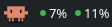
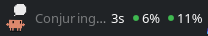
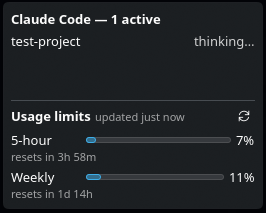

# Claude Status Bar for KDE

A KDE Plasma 6 plasmoid showing Claude Code's live activity in the panel, with
the account's 5-hour and weekly usage percentages on the right.

- **Panel:** state glyph, tool label ("Editing"…), an elapsed timer, and
  `5h N% · 7d N%`.
- **Popup:** per-session list plus 5-hour / weekly usage bars, each with a
  reset-time countdown and a manual refresh button.
- **Configure** (right-click → Configure): hide the panel usage percentages.

## Screenshots

Panel widget, idle — state glyph and `5h % · 7d %`:



Panel widget, working — tool label and elapsed timer:



Popup — per-session list plus 5-hour / weekly usage bars with reset countdowns:



---

## Requirements

Make sure all of these are present **before** running the installer:

| Requirement | Why | Check |
|---|---|---|
| **KDE Plasma 6** (Qt6 / KF6) | The widget targets the Plasma 6 applet API. Plasma 5 is not supported. | `plasmashell --version` |
| **`kpackagetool6`** | Installs/upgrades the plasmoid package. Ships with Plasma 6. | `which kpackagetool6` |
| **Python 3** | Runs the hook, aggregate, and usage-fetch scripts. | `python3 --version` |
| **Claude Code CLI, logged in** | Usage is read from the local OAuth token at `~/.claude/.credentials.json`. | `claude --version` |

The installer also reads `~/.claude/settings.json` (creating it if missing) to
register hooks. No root/sudo is needed — everything installs into your home
directory.

---

## Quick install

From the repository root:

```bash
./install.sh
```

Then **add the widget to a panel**: right-click your panel → *Add Widgets…* →
search for **Claude Status Bar** → click to add.

If the widget does not show up in the list immediately, restart Plasma Shell:

```bash
kquitapp6 plasmashell && kstart plasmashell
```

That's it. Open a Claude Code session in a terminal and the panel will start
updating.

---

## What the installer does

`install.sh` performs three steps, all scoped to your user account:

### 1. Copies the Python scripts

Into `${XDG_DATA_HOME:-$HOME/.local/share}/claude-status-bar/bin/`:

- `statusbar_paths.py` — shared path helpers
- `claude-status-hook.py` — turns each Claude Code hook event into a
  per-session status file
- `claude-status-aggregate.py` — merges all session files into one JSON line
  (polled by the plasmoid)
- `usage-fetch.py` — fetches subscription usage and caches it

It also **bakes your installed Claude version** into `usage-fetch.py`'s
User-Agent header (read from `claude --version`), so the usage endpoint sees a
matching client string.

### 2. Registers Claude Code hooks

It merges hook entries into `~/.claude/settings.json` (backing the file up to
`settings.json.bak.<timestamp>` first). The merge is **idempotent and additive**
— it only adds our entries and never touches existing hooks. Hooks are added for
these events:

`SessionStart`, `UserPromptSubmit`, `PreToolUse`, `PostToolUse`,
`PostToolUseFailure`, `Notification`, `Stop`, `SessionEnd`.

Each hook simply runs `python3 <bin>/claude-status-hook.py <EventName>`, which
writes a small JSON file describing the session's current state. Hooks always
exit 0 and can never fail your Claude Code session.

### 3. Installs the plasmoid

Via `kpackagetool6`, installing the `package/` directory as the
`org.kde.claudestatusbar` applet (falling back to `--upgrade` if it's already
installed).

---

## Verifying the install

1. **Scripts present:**
   ```bash
   ls ~/.local/share/claude-status-bar/bin/
   ```
   You should see the four `.py` files.

2. **Hooks registered:**
   ```bash
   grep claude-status-hook ~/.claude/settings.json
   ```

3. **Plasmoid registered:**
   ```bash
   kpackagetool6 --type Plasma/Applet --list | grep claudestatusbar
   ```

4. **End to end:** start a Claude Code session in any terminal. Within a couple
   of seconds the panel glyph/label should change, and the popup should list the
   session. Usage percentages appear once the first fetch succeeds (usage is
   polled at most every 5 minutes).

---

## Data & files

Everything lives under `${XDG_DATA_HOME:-$HOME/.local/share}/claude-status-bar/`:

```
claude-status-bar/
├── bin/                 # installed Python scripts
├── sessions/            # one JSON file per live Claude Code session
└── usage-cache.json     # last known 5h / 7d usage
```

### Usage data

Usage comes from Claude's `/api/oauth/usage` endpoint (the same source as the
`/usage` command), polled at most every 5 minutes. It is undocumented and
rate-limited; if a fetch fails, the last known values are shown dimmed. A manual
refresh button in the popup forces an immediate re-fetch.

---

## Updating

Pull the latest changes and re-run the installer — it upgrades the package and
re-syncs the scripts and hooks in place:

```bash
git pull
./install.sh
```

If you changed only the QML (widget UI), a Plasma Shell restart is needed to
clear its applet cache:

```bash
kquitapp6 plasmashell && kstart plasmashell
```

---

## Uninstall

```bash
./uninstall.sh
```

This removes the plasmoid and strips **only** our hook entries from
`~/.claude/settings.json` (again backing it up first). It intentionally leaves
the data directory (`~/.local/share/claude-status-bar/`) in place — remove it
manually if you want a clean slate:

```bash
rm -rf ~/.local/share/claude-status-bar
```

---

## Troubleshooting

**Widget doesn't appear in "Add Widgets".**
Restart Plasma Shell: `kquitapp6 plasmashell && kstart plasmashell`. Confirm it
is registered with `kpackagetool6 --type Plasma/Applet --list | grep
claudestatusbar`.

**Panel never updates during a Claude session.**
Check that the hooks landed in `~/.claude/settings.json` (see *Verifying*
above), and that session files appear while a session runs:
`ls ~/.local/share/claude-status-bar/sessions/`. If the directory stays empty,
the hooks aren't firing — re-run `./install.sh`.

**Usage shows dashes / stays dimmed.**
Make sure Claude Code is logged in (`~/.claude/.credentials.json` exists). Run
the fetcher directly to see the error:
```bash
python3 ~/.local/share/claude-status-bar/bin/usage-fetch.py
```
A `reauth` status means the OAuth token expired — re-login with Claude Code. A
`rate_limited` status means you hit the endpoint's rate limit; it will recover
on the next poll.

**`kpackagetool6: command not found`.**
You're likely on Plasma 5 or KDE isn't fully installed. This plasmoid requires
Plasma 6.

---

## Development

Run the Python test suite with:

```bash
python3 -m pytest
```

Tests cover the hook, aggregate, usage-fetch, path, and settings-merge logic.

---

## Credits

The animated Clawd crab artwork (`package/contents/icons/clawd/*.webp`) is
derived from [clawd-tank](https://github.com/marciogranzotto/clawd-tank) by
Marcio Granzotto, used under the MIT License (see
`package/contents/icons/clawd/LICENSE.clawd-tank`). The SVG animations were
rendered to animated WebP for use in the plasmoid.
